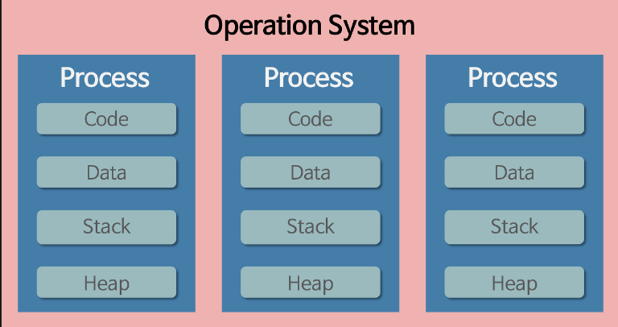

# 목차
- [목차](#목차)
- [프로세스&스레드](#프로세스스레드)
  - [__프로세스 (Process)__](#프로세스-process)
    - [__1. 멀티 태스킹__](#1-멀티-태스킹)
    - [__2. 스케줄링__](#2-스케줄링)
    - [__3. 프로세스 구조__](#3-프로세스-구조)
    - [__4.프로세스 상태__](#4프로세스-상태)
    - [__5.멀티 프로세스__](#5멀티-프로세스)
  - [__스레드(Thread)__](#스레드thread)
    - [__1.스레드가 필요한 이유?__](#1스레드가-필요한-이유)
    - [__2.자바 스레드__](#2자바-스레드)
    - [__3.멀티 스레드__](#3멀티-스레드)
   

# 프로세스&스레드

 

* 프로그램  
  * 특정 작업을 하기 위한 명령어들과 필요한 데이터를 묶어 놓은 파일   
  
 

* 프로세스 (Process)   
  * 프로그램이 메모리(RAM)에 올라와 운영체제로부터 CPU 자원을 할당   
    (=프로그램의 인스턴스 생성)받고, 프로그램이 실행되고 있는 상태
  * 프로세스간 자원 공유X   
   *접근하려면 프로세스 간의 통신 필요(IPC,LPC,공유메모리)
  
 

* 스레드 (Thread)
  * 프로세스가 할당받은 자원을 이용하여 실행하는 단위   
  * 프로세스 내에서 스레드간에 자원을 공유
  * 한 프로세스 내에 여러개 생길 수 있음

  

## __프로세스 (Process)__
할당  
메모리로 가져옴 > PCB 생성  
PCB : Process Control Block (PID,메모리정보,프로그램 카운터 등)
   

### __1. 멀티 태스킹__
  프로세스들이 동시에 실행되는 것 처럼 보이지만,     
  OS가 <u>스케줄링</u> 방식에 따라 빠르게 Task(Process보다 넓은 범위)들을 번갈아가며 처리하는 방법.      
  OS는 멀티태스킹을 통해 여러 프로세스를 실행하고 관리할 수 있다.  
  유튜브를 보며 메신저,게임 등을 할 수 있는 이유.
  
 

### __2. 스케줄링__ 
 

### __3. 프로세스 구조__ 

운영체제는 프로세스마다 각각 독립된 메모리 영역을 Code/Data/Stack/Heap의 형식으로 할당,  
따라서 프로세스는 다른 프로세스의 자원에 접근할 수 없음.  

* 코드 영역(Code Area) : 컴파일된 소스 코드 저장     
* 데이터 영역(Data Area) : 전역변수,static 변수 등 
* 스택 영역(Stack Area) : 임시 데이터(함수 호출, 지역 변수 등) 저장    
* 힙 영역(Heap Area) : 컴파일 단계에서 확인 할 수 없는, 코드에서 동적으로 생성되는 데이터 저장(malloc(), new 등)
  

### __4.프로세스 상태__
생성 상태(Create State) : 프로그램을 메모리에 가져와 실행 준비가 완료된 상태, PCB 생성됨   
준비 상태(Ready State) : 실행을 기다리는 모든 프로세스가 자기 차례를 기다리는 상태  
실행 상태(Running State) : 선택된 프로세스가 CPU를 사용하는 상태  
대기 상태 : 실행 상태에 있는 프로세스가 입출력을 요청하면 입출력이 완료될 떄 까지 기다리는 상태  
완료 상태 : 프로세스 종료 ,PCB 삭제 

 

### __5.멀티 프로세스__
하나의 프로그램을 여러 개의 프로세스로 구성.  
작업(Task)을 협력해 처리하도록 하는 것(병렬처리).

  

## __스레드(Thread)__

프로세스가 할당받은 메모리 영역 내에서 Stack 영역만 별도로 할당 받고 나머지는 공유  
프로세스가 생성되면 하나의 메인 스레드가 생성됨.  
프로세스와 스레드를 코드(프로세스) 내에서의 함수(스레드)로 이해하면 편하다.

### __1.스레드가 필요한 이유?__

### __2.자바 스레드__

### __3.멀티 스레드__
하나의 프로세스가 여러 작업(Task)을 여러 스레드를 사용하여 동시에 처리하는 것.  
(싱글 스레드는 두개의 작업을 순차처리)  
*동기화문제